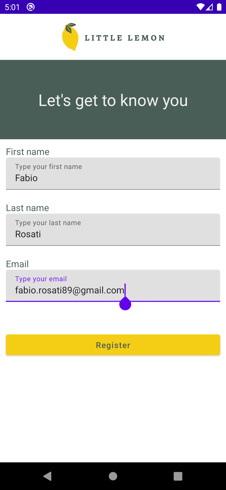
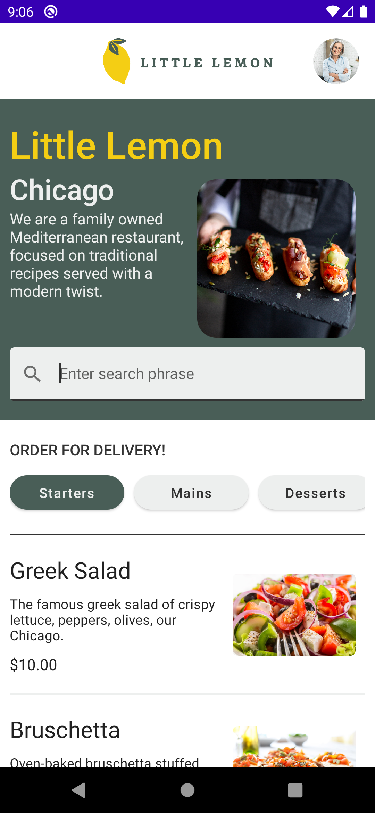
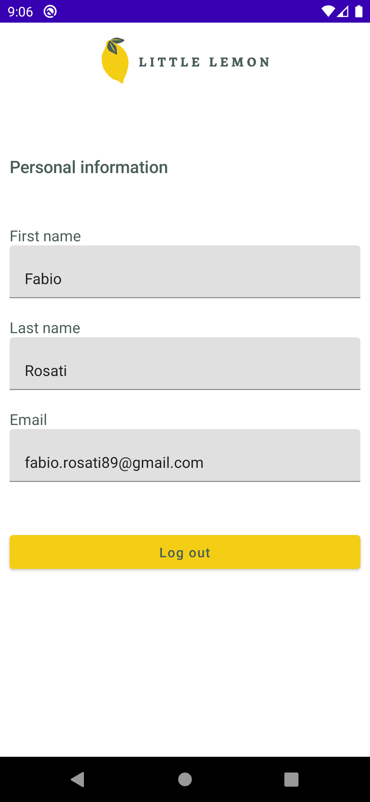

# Little Lemon menu app
Capstone project for the [Meta Android Developer Professional Certificate](https://coursera.org/share/f68a182f6630fec1aed522ba99ea63c3).
This version of the app has been improved with more features.

## Description
This is a multiscreen app designed to fetch and display a restaurant menu.
- The user is welcomed with a (fake) login screen. The user data is asked once and persists upon app relaunch.
- The menu screen shows all the dishes and allows to filter by category and text search. The menu data is fetched once from the internet and stored in a local database.
- The user can log out clearing all data.
- Push notifications can be received and displayed.

## Screenshots

  
   
  

## Tech Stack
| Tech Stack                                                                               | High-level Implementation Description            |
|------------------------------------------------------------------------------------------|--------------------------------------------------|
| [Jetpack Compose](https://developer.android.com/jetpack/compose)                         | Implement reactive UI using composable functions | 
| [MVVM](https://medium.com/swlh/understanding-mvvm-architecture-in-android-aa66f7e1a70b)  | Structure the app with a design pattern          |
| [Dagger Hilt](https://developer.android.com/training/dependency-injection/hilt-android)  | Inject dependency                                |
| [Retrofit](https://square.github.io/retrofit/)                                           | Fetch the menu data from the internet            |
| [Room Database](https://developer.android.com/training/data-storage/room)                | Cache the menu data in a local database          |
| [DataStore](https://developer.android.com/topic/libraries/architecture/datastore)        | Store the user data                              |
| [GlideImage](https://bumptech.github.io/glide/)                                          | Load images from URL                             |
| [Compose Navigation](https://developer.android.com/jetpack/compose/navigation)           | Navigate to different screens in the app         |
| [Coroutines](https://kotlinlang.org/docs/coroutines-overview.html)                       | Implement asynchronous flow in the app           |
| [Firebase Cloud Messaging](https://firebase.google.com/docs/cloud-messaging?hl=en)       | Receive and display push notifications           |

## Requirements
- Android Studio Flamingo or later